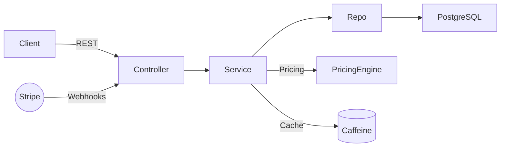
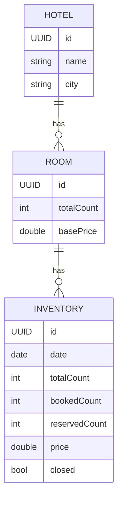

# WanderInn

Production-ready backend for a hotel reservation system built with **Spring Boot 3** and **PostgreSQL/JPA**. It powers **search, booking, payments, and admin**. Dynamic pricing uses **Strategy + Decorator**; hot paths are accelerated with **Caffeine** caching (measured **~58% latency reduction**).


---

## Features
- Search & booking across **10k+ listings**
- **JWT** auth (access/refresh) with role-based authorization
- **Dynamic pricing** via Strategy + Decorator (occupancy, seasonality/holiday, surge, promos)
- **Stripe Checkout** + signature-verified, webhooks
- **Caffeine caching** (per-instance) + min-price precompute → **~58% faster search**
- OpenAPI/Swagger docs, global exception mapping

---

## Architecture (at a glance)
- **Controllers** → REST endpoints, validation, global error mapping  
- **Services** → search, booking, pricing, payments  
- **Repositories (JPA)** → PostgreSQL with paging & selective locking  
- **Pricing Engine** → composable modifiers (Decorator) wrapped in strategies  
- **Caching (Caffeine)** → `inventoryByRoom`, `inventorySearch` with targeted evictions on writes  
- **Webhooks** → deduplicated by `event_id` for idempotency



## Configuration

Create `src/main/resources/application-example.properties`
### Domain Model (Mermaid)



```properties
# --- Server ---
server.port=8080

# --- DataSource (PostgreSQL) ---
spring.datasource.url=jdbc:postgresql://localhost:5432/hotel
spring.datasource.username=hotel_user
spring.datasource.password=change_me

# --- JPA/Hibernate ---
spring.jpa.hibernate.ddl-auto=update
spring.jpa.open-in-view=false
spring.jpa.show-sql=false

server.servlet.context-path=/api/v1

# --- Security (JWT) ---
app.jwt.secret=CHANGE_ME

# --- Stripe ---
stripe.secretKey=sk_test_xxx
stripe.webhookSecret=whsec_xxx

# --- CORS (comma-separated) ---
app.cors.allowed-origins=http://localhost:3000

